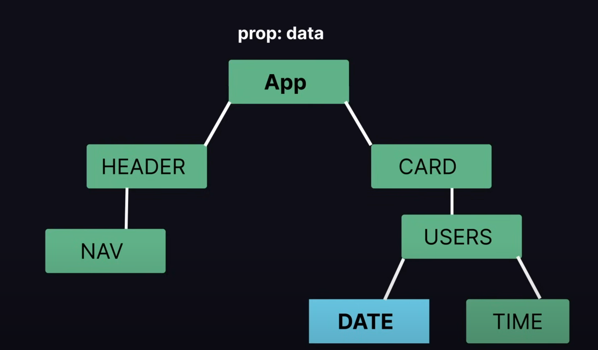

# Learning React.js  

## Topics Covered  
- **Components** → Functional & Class-Based, Multiple Components  
- **JSX** → JavaScript XML & Its Rules  
- **Props** → Destructuring, Multiple Props, Function as Prop  

---

# 📌 NOTES  

## ⚡ React Components  

### 🔹 1. What are React Components?  
- Components are **reusable** building blocks in React.  
- Help in **modular**, **structured**, and **maintainable** UI development.  
- Can be of two types:  
  - **Functional Components** (Modern, simpler approach)  
  - **Class Components** (Older, more complex approach)  

---

### 🔹 2. Functional Components  
- ✅ A **function** that returns JSX.  
- ✅ Receives **props** as arguments.  
- ✅ Easier to read and maintain.  

```jsx
const Greeting = (props) => {
  return <h1>Hello, {props.name}!</h1>;
};

export default Greeting;
```
## 🔹 3. Class-Based Components
- ✅ Uses ES6 classes and extends React.Component.
- ✅ Requires a render() method to return JSX.
- ✅ Used before React Hooks were introduced.

```jsx
import React, { Component } from "react";

class Greeting extends Component {
  render() {
    return <h1>Hello, {this.props.name}!</h1>;
  }
}

export default Greeting;
```

## 🔹 4. Multiple Components
- ✅ React applications consist of multiple components.
- ✅ Each component handles a specific UI section.
- ✅ Components can be combined to create complex interfaces.
``` jsx
const Header = () => <h1>Welcome to My Website</h1>;
const Footer = () => <p>© 2025 All rights reserved.</p>;

const App = () => {
  return (
    <div>
      <Header />
      <p>Main Content Goes Here</p>
      <Footer />
    </div>
  );
};
```
## 🔹 5. Nesting Components
- ✅ Components can be nested inside other components.
- ✅ Helps in better organization of the UI.

```jsx
const Profile = () => {
  return (
    <div>
      <Avatar />
      <UserInfo />
    </div>
  );
};
```

# ⚡ JSX (JavaScript XML)

## 🔹 1. What is JSX?
- JSX is a syntax extension that looks like HTML inside JavaScript.
- Allows writing UI components in an easier and more readable format.
- JSX elements must be wrapped in a single parent tag.

```jsx
const Element = () => {
  return (
    <div>
      <h1>Hello, World!</h1>
      <p>This is a JSX element.</p>
    </div>
  );
};
```

## 🔹 2. JSX Rules
- ✅ Must return a single parent element.
- ✅ Use camelCase for attributes (e.g., className instead of class).
- ✅ Embed JavaScript expressions inside {}.

```jsx
const name = "Alice";
const Element = () => <h1>Hello, {name}!</h1>;
```

## 🔹 3. JSX Expressions

# ⚡ Props (Properties)

## 🔹 1. What are Props?
- Props allow data flow from parent to child components.
- Props are read-only (immutable).

```jsx
const User = (props) => {
  return <p>Name: {props.name}</p>;
};

const App = () => {
  return <User name="Alice" />;
};
```

## 🔹 2. Destructuring Props
- ✅ Props can be destructured for cleaner syntax.

```jsx
const Greeting = ({ name }) => {
  return <h1>Hello, {name}!</h1>;
};
```

## 3. Multiple Props
- ✅ A component can receive multiple props.

```jsx
const UserInfo = ({ name, age }) => {
  return (
    <div>
      <h1>Name: {name}</h1>
      <p>Age: {age}</p>
    </div>
  );
};

const App = () => {
  return <UserInfo name="Alice" age={25} />;
};
```

## 4. Passing Functions as Props
- ✅ Functions can be passed as props to handle events.

```jsx
const Button = ({ onClick }) => {
  return <button onClick={onClick}>Click Me</button>;
};

const App = () => {
  const handleClick = () => {
    alert("Button Clicked!");
  };

  return <Button onClick={handleClick} />;
};
```

## 5. Children Props
- ✅ The `children` prop is a **special prop** in React used to **render child elements** inside a component.  
- ✅ Allows components to wrap and display **nested elements** inside them. 
- ✅ The `children` prop enables a component to **wrap other elements**.  

```jsx
const Card = (props) => {
  return <div className="card">{props.children}</div>;
};

const App = () => {
  return (
    <Card>
      <h2>Title</h2>
      <p>This is inside the Card component.</p>
    </Card>
  );
};
```

## 6. Children Props With Conditional Rendering

- ✅ Dynamically display diffrent UI components or content based on specific condition

```jsx

export const ValidPassword = () => {
  return (
    <div>Valid Password</div>
  )
}

export const InvalidPassword = () => {
    return (
      <div>Invalid Password</div>
    )
  }


export const Password = ({isValid}) => {

    if(isValid){
        return <ValidPassword />
    }
    return <InvalidPassword />
};

const App = () => {
  return (
    <Password isValid={true} />
  )
};
```
# 🆒 Styling

## 1. Inline Styling

- ✅ Applied directly within the `style` attribute of an element.
- ✅ Useful for quick styling without the need for external stylesheets.
- ✅ Less reusable compared to other styling methods.


```jsx
const Card = ({ children }) => {
  return (
    <div style={{
       color: "white" ,   // Text Color
       backgroundColor : "teal" ,  // Background Color
       padding : "2rem" ,        // Padding
       display: "inline-block" // Display
      }}>{children}</div>
  )
}

export default Card;
```
## 2. Dynamic Styling

- ✅ Uses JavaScript objects to store style properties.
- ✅ Allows conditional styling based on props or state.
- ✅ More readable and reusable than inline styling.

``` jsx
const styles = {
    color : "white", 
    backgroundColor : "crimson" , 
    padding : "2rem"
}

const Greetings = (props) => {
    return (
        <div>
            <p style={styles}>
            Hello! Great To See You Here {props.name}
            </p>
        </div>
    )
}
```

## 3. External Styling

- ✅ Uses an external CSS file for styling.
- ✅ Keeps styles separate from component logic, improving maintainability.
- ✅ Allows for easy global styling across multiple components.

``` jsx
import "../index.css"

const Button = ({onClick}) => {
    return (
        <button onClick={onClick}>Click Me!!!</button>
    )
};
```
### index.css
``` css
button {
    display: block;
    color : white ;
    padding: 5px;
    margin-bottom: 10px;
    background-color: aquamarine;
    border-width: 0px;
    border: none;
    border-radius: 4px;
}
```

# 🌲 Events

## 1. Onclick()

- ✅ The onClick event triggers when an element is clicked.
- ✅ It is commonly used for buttons, divs, or interactive elements.
- ✅ In the example, clicking the button triggers an alert message.

``` jsx
const Events = () => {
    return (
        <div>
            <button onClick={ () => alert('Button Clicked')}>Click Me</button>
        </div>
    )
};

export default Events;
```

## 2. Oncopy()

- ✅ The onCopy event fires when the user copies text.
- ✅ It helps in tracking when content is copied from a webpage.
- ✅ In the example, copying the paragraph triggers an alert.

``` jsx
const copyHandler = () => {
    alert('You Have Copied Some Text');
}
const Copy = () => {
    return (
        <p onCopy={ copyHandler }>Lorem ipsum dolor 
        sit amet consectetur adipisicing elit. 
        Commodi impedit minus vitae explicabo labore
         nam laudantium nobis at quibusdam vero!</p>
    )
};

export default Copy;
```

# 💨 State

## Defination
State is a way to store and manage data that can change 
over time and affects how the component renders.
we define state using useState Hook, which allows us  
to set and initial value and provides a way to update the state.

## useState()
useState Hook allows us to track state in a functional component.
State generally refers to data or properties that need to be
tracking in an application.

## Syntax

``` jsx
const [data , changeData] = useState() ;
```

data -> Intial Value <br/>
changeData -> Change Value

#### Example
``` jsx
import {useState} from "react";

const State = () => {

    const [count , setCount] = useState(0) ;

    return <div>{count}</div>
}
export default State;
```

count --> variable <br/>
setCount --> function

## Note

- When value of the state changes the component is re-rendered .
- useState Cant be used conditionally (Hooks must be called in exact same order in every component render).

### Example

``` jsx
import { useState } from "react";
const State = () => {
    const [count, setCount] = useState(0);
    const increment = () => setCount(count + 1);
    return (
        <div>
            <p>{count}</p>
            <button onClick={ increment }>+</button>
        </div>
    )
}
export default State;
```

## useState() Using A Array

#### Example

``` jsx
import { useState } from "react";
const Friends = () => {
    const [friendsli, setFriends] = useState(["Arun", "Aditya"]);
    const addFriends = () => setFriends([...friendsli, "Souvik"]);
    return (
        <div>
            {friendsli.map((f) => (
                <li key={Math.random()}>{f}</li>
            ))}
            <button onClick={ addFriends }>Add Friends</button>
        </div>
    );
};
export default Friends;
```
##### Spread Operator
The spread operator (...) allows you to expand elements from an iterable (like an array, object, or string) into a new array or object. It is useful for copying, merging, and modifying data structures without mutating them

- In The Example Spread Operator Is Used : <br/>
...friendsli → The spread operator (...) is used to copy all elements from friendsli into a new array.

## useState() Using A Object

#### Example

``` jsx
import { useState } from "react";
const Movie = () => {
    const [movies, setMovies] = useState({
        title: 'Interstellar',
        rating: 5
    });
    const updateRating = () => {
        const copyMovie = {
            ...movies,
            rating: 3
        }
        setMovies(copyMovie);
    }
    return (
        <div>
            <h2>Title: {movies.title}</h2>
            <h2>Rating: {movies.rating}</h2>
            <button onClick={updateRating}>Update Rating</button>
        </div>
    );
}
export default Movie;
```
## React Portal

Portal is a feature that allows you to render a child component into a DOM node that exists outside the hierarchy of the parent component. This is useful for scenarios like modals , tooltips or dropdowns. Where you want to break out of the usual parent child structure and render in a diffrent part of the DOM.

### Examples

Parent Component
```js
import {useState} from 'react';
import { Popup } from './Popup';

const ClipboardCopy = () => {

    const [inputValue, setInputValue] = useState('');
    const [copied, setCopied] = useState(false);

    const handleCopy = () => {
        navigator.clipboard.writeText(inputValue).then(() => {
            setCopied(true);
            setTimeout(() => setCopied(false), 2000);
        })
    }

    return (
        <div>
            <input type='text' value={inputValue} onChange={e => setInputValue(e.target.value)}></input>
            <button onClick={handleCopy}>Copy</button>
            <Popup copied={copied} />
        </div>
    );
}

export default ClipboardCopy;
```

Child Component

```js
import React from 'react'

export const Popup = ({ copied }) => {
  return (
    <section>
        {copied && (
            <div style={{
                position: 'absolute',
                bottom: '3rem'
            }}>Copied To Clipboard</div>
        )}
    </section>
  )
}
```
## React Hooks

## useEffect() Hook

useEffect Hook allows you to perform side effects in your components. some examples of side effects are
fetching data , directly updating dom etc.

### Syntax
```js
useEffect(() => {
 do your magic
});
```

## Note
- Without Dependency Array useEffect will be called every single render.
- Using useEffect with Conditional Statements

### ❌❌ Not To Do
```js
if(value>0){
  useEffect(() => {
    console.log("call useEffect");
    document.title = `Increment (${value})`;
  });
}
```

### ✅✅ To Do
```js
  useEffect(() => {
    if(value>0){
    console.log("call useEffect");
    document.title = `Increment (${value})`;
    }
  });
```

**Use Conditional Statement Inside The useEffect Hook**

- When Empty Dependency Array is specified useEffect will only render on initial render not every render.

Example : 
```js
  useEffect(() => {
    if(value>0){
    console.log("call useEffect");
    document.title = `Increment (${value})`;
    }
  },[  ]); // Empty Dependency Array.
```

- When a Value is Specified in Dependency array it will rerender only when the value mention changes.

Example : 
```js
  useEffect(() => {
    if(value>0){
    console.log("call useEffect");
    document.title = `Increment (${value})`;
    }
  },[value]); // Dependency Array With Value
```
## Example Of useEffect Hook

1. Counter

```js
import { useState, useEffect } from "react";

const Effect = () => {

    const [value,setValue] = useState(0);

    useEffect(() => {
        console.log('Call useEffect');
        document.title = `Increment ${value}`
    })

    return (
        <div>
            <h2>{value}</h2>
            <button onClick={() => setValue(value + 1)}>Click Me</button>
        </div>
    );
}

export default Effect;
```
**Everytime button is clicked the useEffect hook is called and it rerenders the component and sents a console log 
that it has been triggered.**

2. Counter With Empty Dependency Array

```js
import { useState, useEffect } from "react";

const Effect = () => {

    const [value,setValue] = useState(0);

    useEffect(() => {
        console.log('Call useEffect');
        document.title = `Increment ${value}`
    },[]);

    return (
        <div>
            <h2>{value}</h2>
            <button onClick={() => setValue(value + 1)}>Click Me</button>
        </div>
    );
}

export default Effect;
```
**After Adding Empty Dependency Array The useEffect Hook only Renders it intially when the page is loaded**

3. Counter With Dependency Array with value
```js
import { useState, useEffect } from "react";

const Effect = () => {

    const [value,setValue] = useState(0);

    useEffect(() => {
        console.log('Call useEffect');
        document.title = `Increment ${value}`
    },[value]); //Dependency Array

    return (
        <div>
            <h2>{value}</h2>
            <button onClick={() => setValue(value + 1)}>Click Me</button>
        </div>
    );
}

export default Effect;
```
**Everytime the value of the variable value changes the useEffect Hook Re-Renders the component**

## Fetching Data Using useEffect()

Fetching Data From JSON Placeholder API

### Syntax

```js
useEffect(() => {
  async function(){
    const response = await fetch("https://jsonplaceholder.typicode.com/posts");
    const data = await response.json();
  }
});
```

### Example

```js
import { useState, useEffect } from "react";

const Data = () => {

    const[data,setData] = useState([]);

    useEffect(() => {
        async function getData() {
            const response =  await fetch("https://jsonplaceholder.typicode.com/todos"); //API Link
            const data = await response.json();
            if(data && data.length) setData(data);

        }

        getData();
    },[]);

    return (
        <div>
            <ul>
                {data.map(todo => (
                    <li key={todo.id}>{todo.title}</li>
                ))}
            </ul>
        </div>
    );
}

export default Data;
```
## Prop Drilling

Prop drilling is a concept in React where data (props) is passed from a parent component to deeply nested child components through multiple intermediary components, even if some of those components do not need the data themselves. This can make the code harder to maintain and less efficient.



### **Example :**
- App.jsx
```js
const App = () => {
  const name = "Alice";
  return (
    <div>
  <ComponentA name={name} />
    </div>
    );
}
```
- ComponentA.jsx
```js
const ComponentA = ({name}) => {
      return (
        <div>
        <ComponentB name={name} />
        </div>
      )
}
```
- ComponentB.jsx
```js
const ComponentB = ({name}) => {
      return (
        <div>
        <ComponentC name={name} />
        </div>
      )
}
```
- ComponentC.jsx
```js
const ComponentC = ({name}) => {
      return (
        <div>
        <p> Name : {name} </p>
        </div>
      )
}
```
## Context API

Context API is a feature that allows you to manage and share state across your components tree
without having to pass props down manually at every level.Its useful for scenarios where you
need to share data or functions across many components, especially when they are deeply nested.

### Syntax
**Example** :
```jsx
import {createContext} from 'react'
export const Data = createContext(); // Creating A Instance
const App = () => {
  const name = "Alice"; // Data To Be Provided
  return (
    <div>
    <Data.Provider value = {name}> // Using Provider Property To Send Data To The Component
    <ComponentA />
    </Data.Provider>
    </div>
  )
}
```

### Example

- **Context.jsx**
```jsx
import { createContext } from "react";
import ComponentA from "./ComponentA";

export const Data = createContext(); // Create Context

const Context = () => {
    const name = "Alice"; // Data to pass

    return (
        <Data.Provider value={name}> {/* Providing data to children */}
            <ComponentA />
        </Data.Provider>
    );
}

export default Context;
```

- **ComponentA.jsx**
```jsx
import { Data } from "./Context";

const ComponentA = () => {
  return (
    <Data.Consumer>
      {(name) => {
        return <h1>Name: {name}</h1>;
      }}
    </Data.Consumer>
  );
};

export default ComponentA;
```
- Provider Property is used to send data to other components.
- Consumer Property is used to recieve data from other components.

## Multiple Data (Using Multiple Instance)

### Example

- **Context.jsx**
```jsx
import { createContext } from "react";
import ComponentA from "./ComponentA";

export const Data = createContext(); // First Instance
export const Data1 = createContext(); // Second Instance

const Context = () => {
    const name = "Alice"; // Data to pass
    const age = 25; // Second Data

    return (
        <Data.Provider value={name}>
            <Data1.Provider value={age}>
            <ComponentA />
            </Data1.Provider>
        </Data.Provider>
    );
}

export default Context;
```

- **ComponentA.jsx**
```jsx
import { Data } from "./Context";
import { Data1 } from "./Context";

const ComponentA = () => {
  return (
    <Data.Consumer>
      {(name) => {
        return (
            <Data1.Consumer>
                {(age) => {
                    return <h1>Name : {name} and Age: {age}</h1>
                }}
            </Data1.Consumer>
        )
      }}
    </Data.Consumer>
  );
};

export default ComponentA;
```

- For Multiple Data U Nest The Provider Functions To Send Data & Nest Consumer To Recieve It.

## useContext() Hook

useContext Hook allows us to access the context values provided by a Context object directly within
a functional component.Context provides a way to pass data through the component tree without having
to pass props down manually.

### Syntax

```jsx
import {useContext} from 'react'

const userName = useContext(Data);
```

### Example

```jsx
import { useContext } from "react";
import { Data } from "./ContextHook.jsx";

const ComponentB = () => {

    const userName = useContext(Data);


    return (
        <div>
            {userName}
        </div>
    );
}

export default ComponentB;
```
## useReducer() Hook

useReducer Hook is similar to useState Hook but its designed for more complex state objects or state transitions that involve multiple sub-values.it allows you to manage state in a functional , immutable way.

### Syntax

```jsx
const[state,dispatch] = useReducer(reducer,intialState)
```

- intialState : starting value for the state when component first renders
- reducer : this function defines how the state should change based on current actions. it takes current state and an action as inputs, and returns a new state.
- state : current state value, which you can use in your component.
- dispatch : a function you can call to send actions to the reducer, which updates state.

### Example

```jsx
import { useReducer } from "react";

const initialState = {count : 0};

const reducer = (state,action) => {
    switch (action.type) {
        case "increment":
            return {...state , count: state.count + 1};
        case "decrement":
            return {...state , count: state.count - 1};
        case "reset":
            return {...state , count : 0};
        default:
            return state;
    }
}


const Reducer = () => {

    const [state , dispatcher] = useReducer(reducer, initialState);

    return (
        <div>
            <h1>{state.count}</h1>
            <button onClick={() => dispatcher({type : "increment"})}>+</button>
            <button onClick={() => dispatcher({type : "decrement"})}>-</button>
            <button onClick={() => dispatcher({type : "reset"})}>Reset</button>
        </div>
    );
};

export default Reducer;
```

## useRef Hook

useRef Hook provides a way to access and interact with DOM elements or to persist values across renders without causing re-render.

### Syntax

```jsx
import {useRef} from 'react';

const element = useRef(initialValue);
```

### Examples


```jsx
import { useRef } from "react";

const Ref = () => {

    const inputElement = useRef(null);
    const focusInput = () => {
        inputElement.current.focus();
        inputElement.current.value = "Alice";
    }

    return (
        <div>
            <input type="text" ref={inputElement}></input>
            <button onClick={() => focusInput()}>Focus & Write Alice</button>
        </div>
    );
}

export default Ref;
```
## Custom Hooks

Custom Hooks are JS Functions that start with the prefix use (eg: useFetch , useForm) and can call other hooks within them. they allow you to extract and reuse logic that involves states or side effects , making your component more readable and maintainable.

### Example : 

```jsx

const useFetch = (url) => { // Custom Hook Named Fetch (useFetch)
  
  const[data,setData] = useState(null);

  useEffect(() => {
    fetch(url)
    .then((res) => res.json())
    .then((data) => setData(data));
  },[url]);

return [data];

};
```

## useID Hook

The useId hook in React is used to generate unique IDs for components;

### Example

```jsx
import {useId} from 'react'

const UniqueID = () => {

  const id = useId();

  return (
    <div>
    <label htmlFor={`${id}`}>Email</label>
    <input type="email" htmlFor={`${id}`}/>
    </div>
  );
}
```

## Advanced React Concepts

## React Router
React Router is a popular library used for handling routing in React applications. It allows developers to create single-page applications (SPAs) with multiple views while maintaining seamless navigation without requiring full-page reloads.

### Installation
```bash
npm install react-router-dom
```

### Setup

```jsx
import React from "react";
import { BrowserRouter, Routes, Route } from "react-router-dom";
import Home from "./Home";
import About from "./About";

function App() {
  return (
    <BrowserRouter>
      <Routes>
        <Route path="/" element={<Home />} />
        <Route path="/about" element={<About />} />
      </Routes>
    </BrowserRouter>
  );
}

export default App;
```

### Navigating Between Pages

- **Using *Link* tag we can navigate to various pages**
- **Using *to* property in Link Tag we can specify the url to route to.**

```jsx
import { Link } from "react-router-dom";

function Navbar() {
  return (
    <nav>
      <Link to="/">Home</Link>
      <Link to="/about">About</Link>
    </nav>
  );
}

export default Navbar;
```
### Nested Routes

```jsx
import { Routes, Route } from "react-router-dom";
import Dashboard from "./Dashboard";
import Profile from "./Profile";
import Settings from "./Settings";

function App() {
  return (
    <Routes>
      <Route path="/dashboard" element={<Dashboard />}>
        <Route path="profile" element={<Profile />} />
        <Route path="settings" element={<Settings />} />
      </Route>
    </Routes>
  );
}

export default App;
```
**Accessin Nested Routes**
- /dashboard/profile
- /dashboard/settings

### Function Outlet

```jsx
import { Outlet } from "react-router-dom";

function Dashboard() {
  return (
    <div>
      <h1>Dashboard</h1>
      <Outlet /> {/* This will render Profile or Settings based on the URL */}
    </div>
  );
}

export default Dashboard;
```

- **Renders the matching child route of a parent route or nothing if no child route matches.**

### Dynamic Routing

Dynamic routing in React Router allows rendering components based on variable parameters in the URL. This is useful for scenarios like:

- Viewing a user profile (/user/123)
- Showing product details (/product/laptop)
- Displaying blog posts (/post/react-router)

**In dynamic routing, parts of the URL can act as parameters, making routes more flexible. These parameters are extracted from the URL and used inside components.**

1. Creating Dynamic Route

```jsx
import { BrowserRouter, Routes, Route } from "react-router-dom";
import UserProfile from "./UserProfile";

function App() {
  return (
    <BrowserRouter>
      <Routes>
        <Route path="/user/:userId" element={<UserProfile />} /> //Dynamic Route
      </Routes>
    </BrowserRouter>
  );
}

export default App;
```

2. Extracting Parameters with useParams()

React Router provides the useParams() hook to access URL parameters inside components.

```jsx
import { useParams } from "react-router-dom";

function UserProfile() {
  let { userId } = useParams();

  return <h1>Profile of User {userId}</h1>;
}

export default UserProfile;
```

**Used To Extract The ID From the URL**

### Programmable Navigation

Use the useNavigate() hook to navigate dynamically.

```jsx
import { useNavigate } from "react-router-dom";

function LoginPage() {
  let navigate = useNavigate();

  function handleLogin() {
    // Perform login logic
    navigate("/dashboard"); // Redirect user after login
  }

  return <button onClick={handleLogin}>Login</button>;
}
```

## AXIOS 

Axios is a promise-based HTTP client for making requests in JavaScript and React applications. It is commonly used for:

- Fetching data from APIs
- Sending data to a backend
- Handling HTTP requests with better error handling

| Feature                        | fetch()                                     | Axios                          |
|--------------------------------|--------------------------------|-------------------------------|
| **Automatic JSON Handling**    | ❌ No (Needs `response.json()`) | ✅ Yes                         |
| **Error Handling**             | ❌ Only rejects on network failure | ✅ Rejects on HTTP errors       |
| **Request Cancellation**       | ❌ No built-in support         | ✅ Yes (`CancelToken`)         |
| **Timeout Support**            | ❌ Requires extra code         | ✅ Yes                         |
| **Intercept Requests & Responses** | ❌ No                        | ✅ Yes                         |
| **Supports Older Browsers**    | ❌ No                          | ✅ Yes                         |

### Installation

```bash
npm install axios
```
**Import Axios**
```jsx
import axios from 'axios';
```

### Making GET Requests

A GET request is used to fetch data from an API.

```jsx
import axios from 'axios'
import { useEffect, useState } from 'react';

const AxiosGet = () => {
    const[data,setData] = useState(null);
    useEffect(() => {
        axios.get('https://jsonplaceholder.typicode.com/posts/1')
        .then(response => {
            setData(response.data);
        });
    },[]);
    return (
        <div>
            <h1>{data?.title}</h1> // Using Optinal Chaining to safely accesses properties of an object without throwing an error
        </div>
    );
}
export default AxiosGet;
```

- What is Optional Chaining (?.)

**Optional chaining (?.) is a JavaScript feature that safely accesses properties of an object without throwing an error if a property is null or undefined.**

**Using Async/Await**

```jsx
async function fetchPost() {
  try {
    const response = await axios.get('https://jsonplaceholder.typicode.com/posts/1');
    console.log(response.data);
  } catch (error) {
    console.error('Error fetching data:', error);
  }
}

fetchPost();
```

### Making POST Requests

A POST request is used to send data to a server.

```jsx
import axios from 'axios'
import { useEffect, useState } from 'react'

const newPost = {
    title: 'New Post',
    body: 'New Post Using Axios On ReactJS',
    userId: 1
}

const AxiosPost = () => {

    const[data,setData] = useState(null);
    useEffect(() => {
        axios.post('https://jsonplaceholder.typicode.com/posts', newPost)
        .then(response => {
            setData(response.data);
        });
    },[]);
    return (
        <div>
            <h1>Posted Successfully !</h1>
            <p>{data?.title}</p>
        </div>
    );
}
export default AxiosPost;
```

### Custom Headers (GET)

- Headers are often required for authentication (e.g., API keys, tokens).

```js
axios.get('https://jsonplaceholder.typicode.com/posts', {
  headers: {
    'Authorization': 'Bearer my-secret-token',
    'Content-Type': 'application/json'
  }
})
.then(response => console.log(response.data))
.catch(error => console.error(error));
```

### Query parameters

- Used When Need Specific Data 
- For Example In Website When Searched A Particular User using UserId
```js
axios.get('https://jsonplaceholder.typicode.com/posts', {
  params: {
    userId: 1
  }
})
.then(response => console.log(response.data))
.catch(error => console.error(error));
```